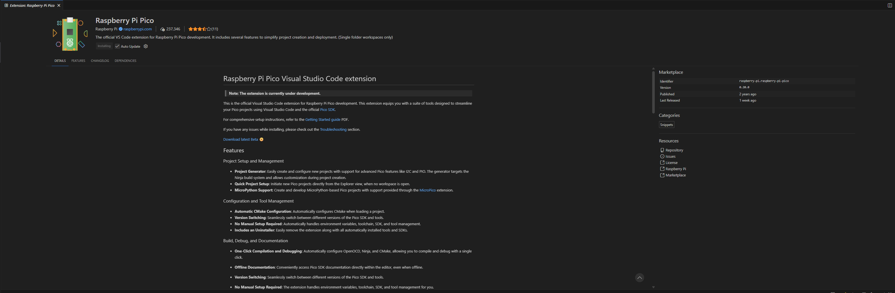
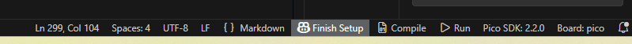
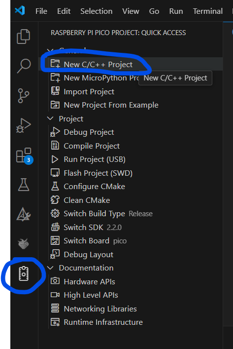
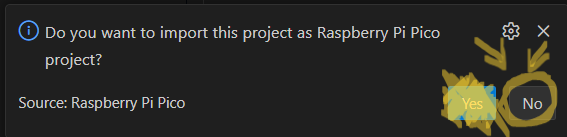
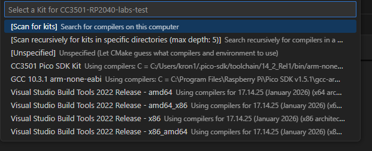
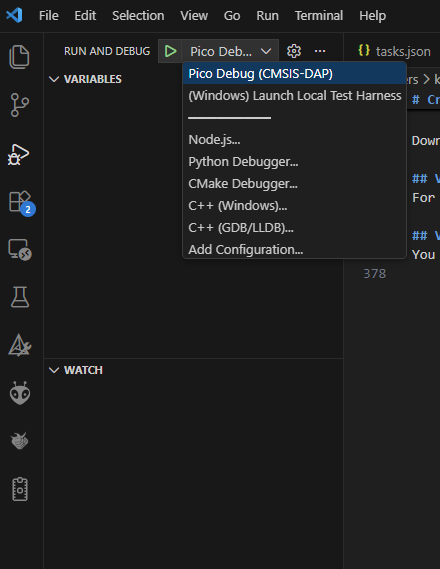

# Starter code for CC3501 labs

This is intended as a starting point for CC3501 students to build their own code for labs. The repository contains:

1. Preconfigured `CMakeLists.txt` that supports building embedded code for the target as well as native Windows code for a test harness.
2. Very minimal example for how to interact with WS2812 addressable LEDs (plus minimal example of native mock for testing purposes).

# Code organisation 

| Path                       | Description                                             |
| -------------------------- | ------------------------------------------------------- |
| `src`                      | Main program source code                                |
| `src/main.cpp`             | Main program entry point                                |
| `src/drivers`              | Hardware drivers                                        |
| `src/drivers/WS2812/`      | Low level driver for WS2812 using PIO                   |
| `src/drivers/logging/`     | Example basic log driver                                |
| `tests`                    | Code to support the native build for testing            |
| `tests/mocks/`             | Mock implementations of Pico SDK to enable native build |


# Setup instructions

Before you clone and open this repository, you must first install Visual Studio Code, install the required extensions, and setup a preliminary test project to allow the Raspberry Pi Pico extension to set up its toolchain.

This first setup step is important. It makes sure that VS Code, the Pico SDK, CMake, Ninja, OpenOCD, the ARM compiler, and related tools are installed correctly before you open the class repository.

## Install Visual Studio Code

Download and install Visual Studio Code:

https://code.visualstudio.com/

After installation, open Visual Studio Code by itself. Do not open the CC3501 repository yet, and do not open any existing Pico project yet.

## Create a clean VS Code profile

It is recommended that you create a separate VS Code profile for this subject. This helps avoid conflicts with extensions and settings from other projects.

1. Open VS Code.
2. Click the cog icon in the bottom-left corner.
3. Select **Profiles**.
4. Select **Create Profile**.
5. Name the profile:

```text
CC3501
```

or:

```text
Pico Programming
```

6. Select the new profile and make sure it has a tick next to it.

## Install the required VS Code extensions

Install the required extensions now. Do not wait for VS Code to prompt you later.

Open the Extensions panel in VS Code and install the following extensions:

1. **Raspberry Pi Pico**
2. **C/C++**
3. **CMake Tools**
4. **Cortex-Debug**
5. **Serial Monitor**
6. **PIOASM Syntax Highlighting**

The Raspberry Pi Pico extension manages the Pico SDK, ARM toolchain, CMake, Ninja, OpenOCD, and related tools.



If the bottom bar shows **Finish Setup**, click it and allow the Pico extension to finish installing the required tools.



## Create a temporary Pico project

Before opening the CC3501 repository, create a new temporary Pico project. This allows the Raspberry Pi Pico extension to fully set up the SDK and toolchain inside your VS Code profile.

1. Open VS Code.

2. Click the **Raspberry Pi Pico** icon in the left-hand activity bar.

   

3. In the **Raspberry Pi Pico Project: Quick Access** panel, click:

   ```text
   New C/C++ Project

4. Create a new project with any temporary name, such as:

```text
pico-test
```

5. Select the following options:

| Setting | Value |
| --- | --- |
| Board type | `Pico` |
| Features | Enable `PIO interface` |
| Stdio support | `Console over USB` |
| Code type | Generate C++ code |
| Other settings | Leave as default |

The Pico extension should generate a simple blink-style project.

Build the temporary project. This confirms that the Pico SDK, compiler, CMake, Ninja, and other build tools are working correctly.

You may also upload the generated `.uf2` file to a Pico or compatible RP2040 board to confirm that the toolchain can produce working firmware.

Once this temporary project builds successfully, close it. You do not need to keep this temporary project.

## Creating your own private copy of the repository

You are now ready to work from the CC3501 starting repository. You should clone the starting repository, create your own private GitHub repository, and then push your copy into that private repository.

This gives you your own private, updateable version of the project. You can push changes as you modify and extend the code.

The following steps explain how to clone the class repository and convert it into your own private GitHub project.

### Step 1: Create a private GitHub repository

1. Log in to GitHub.

2. Click the **+** button in the top-right corner.

3. Select **New repository**.

4. Choose a repository name:

   ```text
   CC3501-RP2040-labs
   ```

5. Set the repository visibility to:

   ```text
   Private
   ```

6. Do **not** add a README.

7. Do **not** add a `.gitignore`.

8. Do **not** add a licence.

The repository must be empty, because you will push the CC3501 starter code into it from your computer.

After creating the private repository, copy its HTTPS clone URL using the green **Code** button.

It should look similar to:

```text
https://github.com/YOUR-USERNAME/CC3501-RP2040-labs.git
```

### Step 2: Clone the CC3501 starting repository

Open a terminal in the folder where you want to store your class work.

Clone the CC3501 starting repository:

```cmd
git clone https://github.com/bronsonp/CC3501-RP2040-labs.git CC3501-RP2040-labs
```

Move into the cloned repository folder:

```cmd
cd CC3501-RP2040-labs
```

This downloads the starting code from the class repository onto your computer.

### Step 3: Convert the cloned repository to your own private project

The cloned repository currently points back to the original class repository. You need to change this so that your pushes go to your own private GitHub repository instead.

First, rename the original class repository remote to `upstream`:

```cmd
git remote rename origin upstream
```

Now add your own private GitHub repository as `origin`.

Replace `YOUR-USERNAME` and the repository name with your actual GitHub details:

```cmd
git remote add origin https://github.com/YOUR-USERNAME/CC3501-RP2040-labs.git
```

To help prevent accidental pushes to the original class repository, disable pushing to `upstream`:

```cmd
git remote set-url --push upstream DISABLED
```

Check that the remotes are correct:

```cmd
git remote -v
```

You should see something similar to:

```text
origin    https://github.com/YOUR-USERNAME/CC3501-RP2040-labs.git (fetch)
origin    https://github.com/YOUR-USERNAME/CC3501-RP2040-labs.git (push)
upstream  https://github.com/bronsonp/CC3501-RP2040-labs.git (fetch)
upstream  DISABLED (push)
```

`origin` is your private repository.

`upstream` is the original CC3501 starting repository.

You should push your work to `origin`, not to `upstream`.

### Step 4: Push the starter code to your private repository

Push the starter code into your private GitHub repository:

```cmd
git push -u origin master
```

Your private GitHub repository should now contain the CC3501 starter code.

### Step 5: Open the project in VS Code

Open the project folder in VS Code:

```cmd
code .
```

You should now be working in your own private copy of the CC3501 labs repository.

## Opening the CC3501 repository

When the repository opens in VS Code, allow VS Code and CMake Tools to configure the project.

If VS Code asks whether to import or convert this folder as a Raspberry Pi Pico project, do **not** import it again. This repository is already configured.

Choose **No**, **Cancel**, **Not now**, or close the prompt.



If VS Code asks you to select a CMake kit for the RP2040 firmware build, select:

```text
CC3501 Pico SDK Kit
```

Do not choose Visual Studio, MinGW, GCC, or `Unspecified` when building for the development board.

# Building for the embedded hardware

Use this mode when you want to build and debug on the RP2040 development board.

## Select the Pico kit

Select the RP2040 firmware kit:

1. Press 'Ctrl + Shift + P'.
2. Search for **CMake: Select a Kit**.
3. Choose:
```text
CC3501 Pico SDK Kit
```
Do not choose Visual Studio, MinGW, GCC , or 'Unspecified' when building for the development board.


## Build the Pico firmware

After selecting **CC3501 Pico SDK Kit**, build the project using one of the following:
1. Click the bottom-bar **Build** button, or
2. Press 'Ctrl + Shift + B', or
3. Use **Terminal → Run Build Task → Build Pico Project**.

A successful embedded build should produce a build folder containing:
```text
build/labs.elf
build/labs.uf2
```

The '.elf' file is used for debugging. The '.uf2' file can be copied to the board in BOOTSEL mode if needed.


## Debugging on the development board

Connect the debug probe and development board.

Minimum SWD connections:

```text
Debug probe GND → Dev board GND
Debug probe SWDIO → Dev board SWDIO
Debug probe SWCLK → Dev board SWCLK
```
Or through the 1/2 pitch 10-pin header with ribbon cable. 

The board does not need to be in BOOTSEL mode for SWD debugging - however the Debug probe must be flashed with the debug probe '.uf2' file (see LearnJCU Reference Materials).

To debug:
1. Build the project first.
2. Open the **Run and Debug** panel.
3. Select:

```text
Pico Debug (CMSIS-DAP)
```

4. Press the green debug/play button.




# Building a native Windows app

Use this mode when you want to run the local/mock test harness on your computer without the RP2040 development board connected.

The native build uses mock implementations in 'tests/mocks/' so that some hardware-like code can be tested locally. This can be useful for testing algorithms, state machines, GPIO-style logic and sensor/LED behaviour using mock inputs/outputs.

## Select the local compiler kit

To switch to local testing:
1. Press 'Ctrl + Shift + P'.
2. Search for **CMake: Select a Kit**. **Note: When switching kits or debug profiles - you may need to select these twice to get them to actually change, based on past user experience.**
3. Select a local compiler kit, such as:

```text 
Visual Studio Build Tools 2022 x86
```

Do not use **CC3501 Pico SDK Kit** for local testing.

## Configure and build locally

When using the local compiler kit, build using the CMake Tools workflow:

1. Press 'Ctrl + Shift + P'.
2. Run **CMake: Configure**.
3. Run **CMake: Build**, or click the bottom-bar **Build** button.

do not use **Build Pico Project** for local testing. That task is for RP2040 firmware builds.

A successful local build should produce a Windows executable, such as:

```text
build/labs.exe
```

## Debug the local test harness

Open **Run and Debug** and select:

```text 
(Windows) Launch Local Test Harness
```

4. Then press the green debug/play button.

If VS Code reports that it cannot find 'labs.exe', run:

```cmd
dir build\*.exe /s
```

and make sure the executable exists. You may need to run **CMake: Configure** and **CMake: Build** again after switching kits.


# Switching between embedded and local builds

The project supports two build modes:

| Mode | CMake kit | Build method | Output |
| --- | --- | --- | --- |
| RP2040 development board | `CC3501 Pico SDK Kit` | Bottom-bar Build, `Ctrl + Shift + B`, or **Build Pico Project** | `build/labs.elf`, `build/labs.uf2` |
| Local/mock testing | Visual Studio Build Tools or approved local compiler | **CMake: Configure**, then **CMake: Build** | `build/labs.exe` |

When switching between the Pico kit and the local compiler kit, CMake may need to reconfigure the project. If the build behaves strangely after switching modes, delete the build folder and build again:

```cmd
rmdir /s /q build
```

Then select the correct kit and rebuild.

# Git workflow

As you complete the lab tasks, you should regularly save your work using Git.

After making changes, check the status:

```cmd
git status
```

Stage your changes:

```cmd
git add .
```

Commit your changes with a short message describing what you changed:

```cmd
git commit -m "Describe the change you made"
```

Push your changes to your private GitHub repository:

```cmd
git push
```

You should push to your own private repository, not the original CC3501 class repository.

You can check where your repository will push by running:

```cmd
git remote -v
```

The `origin` remote should point to your own private GitHub repository.

For example:

```text
origin    https://github.com/YOUR-USERNAME/CC3501-RP2040-labs-yourname.git (fetch)
origin    https://github.com/YOUR-USERNAME/CC3501-RP2040-labs-yourname.git (push)
upstream  https://github.com/bronsonp/CC3501-RP2040-labs.git (fetch)
upstream  DISABLED (push)
```

If `origin` points to `https://github.com/bronsonp/CC3501-RP2040-labs.git`, then your repository has not been set up correctly. Ask for help before pushing.

# Common pitfalls

## Do not import the project again

This repository is already configured. Do not run **Raspberry Pi Pico: Import Project** on this folder.

## Wrong kit selected

If you are building for the RP2040 board, use:

```text
CC3501 Pico SDK Kit
```

If you are running local tests, use a local compiler kit such as:

```text
Visual Studio Build Tools 2022
```

## Pico build cannot find `labs.elf`

Build the Pico firmware first. Then check:

```cmd
dir build\*.elf
```

You should see:

```text
build\labs.elf
```

## Repo Naming 
If you name your GitHub repo incorrectly (i.e. not the format of YOUR-USERNAME/CC3501-RP2040-labs.git) it is possible that the .json project files will no longer point to the correct locations regarding building/compilation paths - so you should either keep your naming consistent or update the file path names where necessary if this problem arises.

## Debug probe detected but target will not connect

If OpenOCD reports that CMSIS-DAP is ready but cannot connect to the RP2040, check:

1. The development board is powered.
2. GND is connected.
3. SWDIO and SWCLK are not swapped.
4. The debug connector is not reversed.
5. The board is not in BOOTSEL mode.

## Local build cannot find `labs.exe`

Make sure you selected a local compiler kit, then run:

```text
CMake: Configure
CMake: Build
```

Then check:

```cmd
dir build\*.exe /s
```

## Do not commit generated files

Do not commit:

```text
build/
.vscode/settings.json
.vscode/.cortex-debug*.json
```

These files are generated locally and are not part of your submitted source code.

# Credits

* The `src/drivers/WS2812/WS2812.pio` file is an example for the RP2040 provided by the Raspberry Pi foundation, used under the terms of the BSD license.
